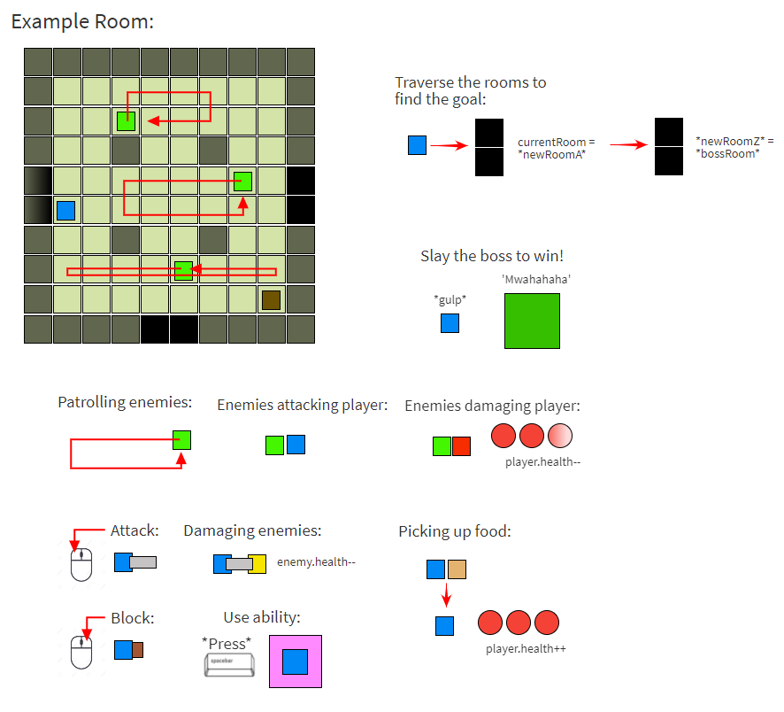
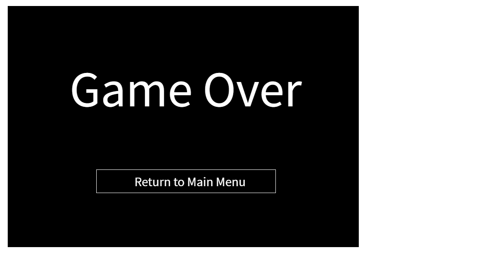

# Demon's Respite

### Deployed Link
https://joseph-galante.github.io/Demons-Respite/

## Overview
Demon's Respite is a rogue-like dungeon crawler similar to the Binding of Isaac. The game throws the player into a dungeon and requires them to traverse the dungeon's many rooms while defeating enemies in preparation to ultimately fight the evil boss, The Demon.

## Why A Rogue-like?
Rogue-likes have an RNG element to them that offers a new experience to the player every time they play the game. Near-endless possibilities means near-endless fun!

## Game Rules
The player must run from room to room in the dungeon to try and find the main room where the final boss awaits. Many enemies inhabit the dungeon's rooms and will attempt to stop the player at all costs, so beware. Slay every enemy to be able to progress to the next room. Slaying the boss is the only way to emerge victorious...so slay or be slayed! Good luck!

## Wireframes
Main Menu

- This screen transitions between the 'How to Play' screen and 'Example Room' (game play)

How to Play

- This screen may return to the main menu

Example gameplay

- All the different UI expected during a game run

Game Over

- This screen may return to the main menu

Player Win

- This screen may return to the main menu

## User Stories
- When I start the game, it takes me to the main menu, displaying a prologue to the game, a 'Play Game' button, and a 'How to Play' button
- When I click the 'How to Play' button it takes me to a screen displaying a 'Main Menu' button, the controls and a general idea of what to expect in the game
- When I click the 'Main Menu' button it returns me to the main menu screen
- When I click the 'Play Game' button it takes me to an empty room and I can start controlling the player
- Pressing the WASD-keys moves the player around
- Clicking the left-mouse button makes the player attack with their current weapon
- Clicking the middle-mouse button makes the player block with their current shield
- Pressing the E-key lets the player interact with chests by opening them and gaining it's contents
- Pressing the spacebar uses the player's ability which does an area of effect attack around the player
- Pressing the Escape-key, while playing, pauses the game and brings up a menu with 'How to Play' and 'Main Menu' options
- Walking over food or gold causes the player to pick them up: food heals the player while gold increases my score
- Walking near enemies makes them chase the player
- Attacking the enemies causes the enemies to take damage and they die and drop coins if their health reaches zero
- If enemies get close to the player they hurt the player and knock them back
- If the player loses all their health they lose and the 'Game Over' screen is displayed which includes a 'Game Over' message and a 'Return to Main Menu' button
- If I click the 'Return to Main Menu' button it takes me to the main menu so I can play again
- While playing, if I enter a corridor it takes the player to another room in the dungeon
- Finding the final room makes a boss appear and the player must fight the boss
- If I defeat the boss, a 'You Win' screen displays as well as a 'Return to Main Menu' button

## Core Goals
Absolute minimum viable project
- Make a player and enemy out of rectangles
- Able to move a player around the rooms
- Player can collect food and gold dropped by enemies
- Enemies move around the rooms and attack the player
- Entering a corridor takes the player to a new room
- Reach the final room to encounter the boss
- Defeat the boss to win the game

## Stretch Goals
Add some extra oomph to the project
- Player can find and open chests in the rooms
- More than one weapon and shield
- More types of enemies
- More types of abilities (class system)
- More difficulties and a longer game
- Parry system with timed blocks
- Better player, equipment, and enemy sprites
- Add animations
- Add audio
